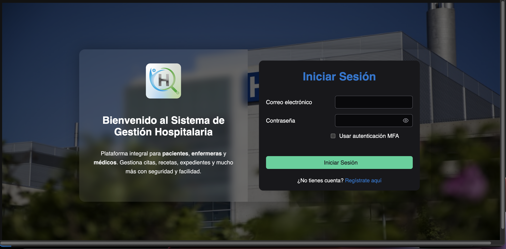
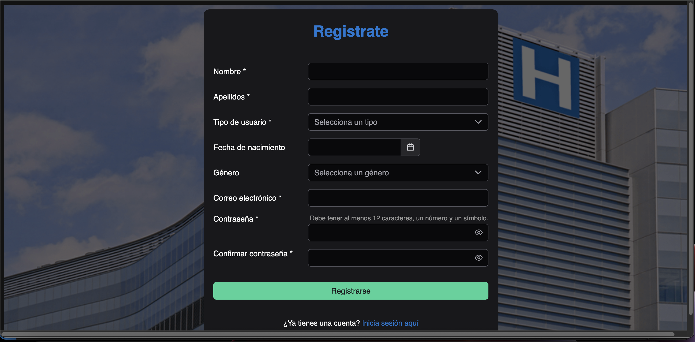
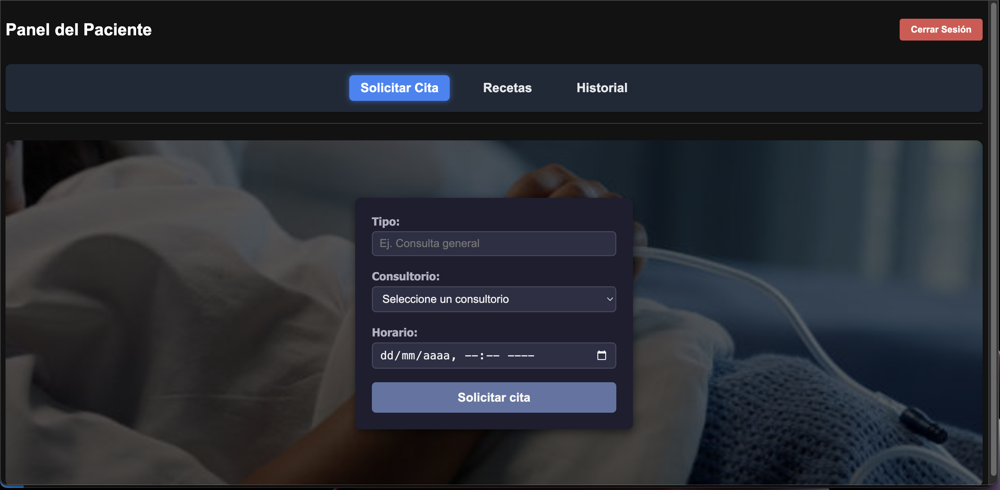
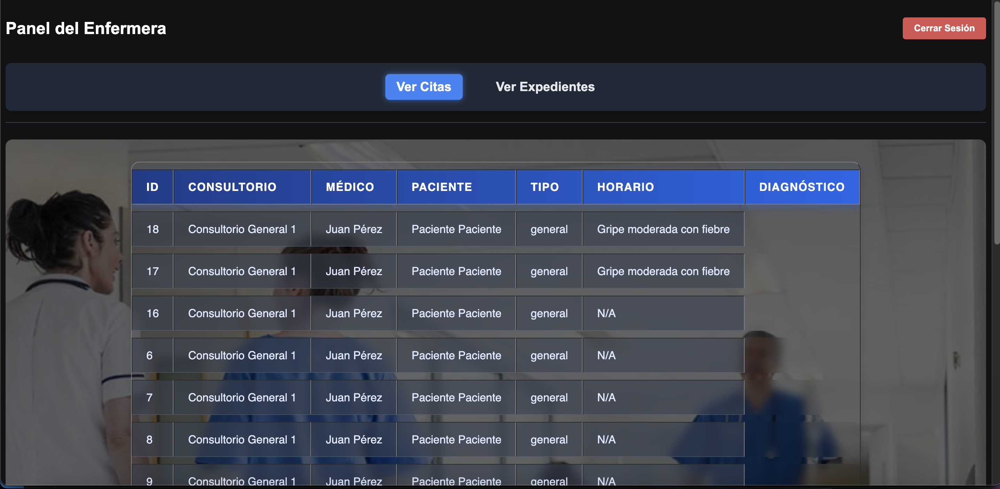
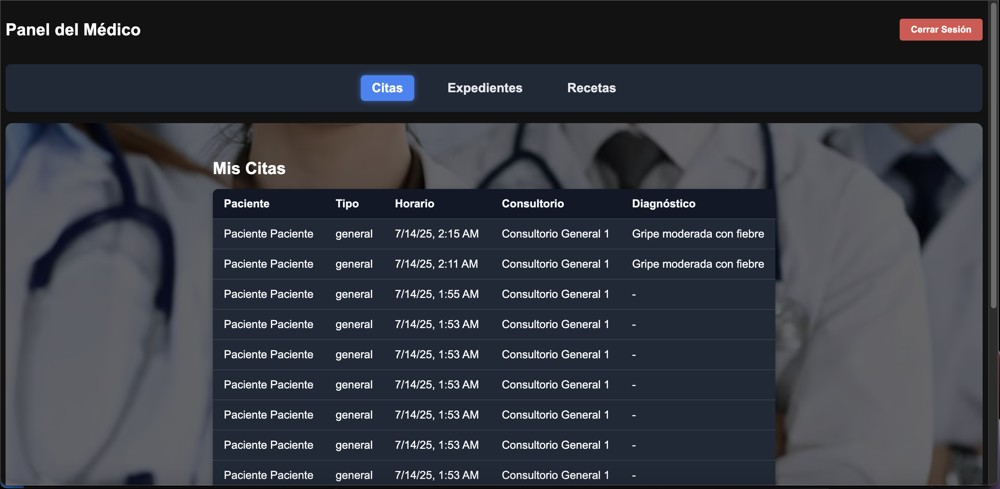

# 🏥 Hospital Frontend

Frontend del sistema hospitalario desarrollado con **Angular 19** y **PrimeNG 19**.

---

## 📁 Estructura actual del proyecto

```
HOSPITAL_FRONTEND/
├── angular/
├── vscode/
├── node_modules/
├── public/
├── SRC/
├── app/
|   ├── assets/
│   ├── guards/
│   ├── interceptors/
│   ├── pages/
│   │   ├── auth/
│   │   │      ├── login/
│   │   │      └── register/
│   │   └── mfa-setup/
│   │   ├── paciente/
│   │   │      └── dashboard/
│   │   │             ├── solicitar-cita/
│   │   │             ├── recetas/
│   │   │             └── historial-citas/
│   │   ├── enfermera/
│   │   │      └── dashboard/
│   │   │             ├── citas/
│   │   │             └── expedientes/
│   │   ├── medico/
│   │   │      └── dashboard/
│   │   │             ├── citas/
│   │   │             ├── expedientes/
│   │   │             └── recetas/
│   │   │             
│   ├── services/
            └── auth.service.ts/
            └── consulta.service.ts/
            └── enfermera.service.ts/
            └── medico.service.ts/          
            └── mfa.service.ts/
            └── paciente.service.ts/ 
│   ├── app.component.css
│   ├── app.component.html
│   ├── app.component.spec.ts
│   ├── app.component.ts
│   ├── app.config.ts
│   ├── app.routes.ts
│   ├── index.html
│   ├── main.ts
│   ├── styles.css
├── .editorconfig
├── .gitignore
├── angular.json
├── package-lock.json
├── package.json
├── README.md
├── tsconfig.app.json
├── tsconfig.json
└── tsconfig.spec.json
```

---
## 📸 Capturas de Pantalla

### 🔐 Login


### 📝 Registro


### 👨‍⚕️ Panel Paciente


### 🧑‍⚕️ Panel Enfermera


### 🩺 Panel Médico



## ✅ Requisitos

- Node.js `v18` o superior  
- npm `v9` o superior  
- Angular CLI (opcional pero recomendado)

---

## 🚀 Instrucciones para ejecutar el proyecto

1. **Clonar el repositorio**
   ```bash
   git clone https://github.com/GabrielReyes3/hospital_frontend
   cd hospital_frontend
   ```

2. **Instalar dependencias**
   ```bash
   npm install
   ```

3. **Levantar el servidor de desarrollo**
   ```bash
   ng serve
   ```

4. **Abrir en el navegador**  
   Ir a [http://localhost:4200](http://localhost:4200) para ver la aplicación en modo desarrollo.

---

## 📝 Notas

- El proyecto utiliza **PrimeNG 19** para los componentes de UI.
- La carpeta principal del código Angular es `app/`.
- Los estilos globales se encuentran en `styles.css`.
- Las rutas y configuración están en la raíz de `app/`.

---

## ⚙️ Comandos útiles

- `ng build` — Genera una versión de producción en la carpeta `dist/`.  
- `ng test` — Ejecuta pruebas unitarias.  
- `ng lint` — Corre el linter para verificar la calidad del código.

---

## 👤 Autor

**Gabriel Reyes**  
[GitHub - GabrielReyes3](https://github.com/GabrielReyes3)
